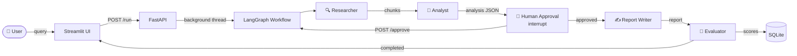

# Multi-Agent Financial Research Assistant — End-to-End Walkthrough

## Big Picture

You built a system where a **user asks a financial question**, and three AI agents
collaborate to produce a professional research report — but **you stay in control**
by reviewing and approving the analysis before the report is written.



---

## Layer 1 — Data (where knowledge lives)

### `data/sample_filings.py`
Contains **15 hand-written SEC filing excerpts** for Apple (AAPL), Microsoft (MSFT),
and Alphabet/Google (GOOGL) — covering business overviews, financial highlights,
AI strategies, risks, and segment results.

These are realistic representations of publicly available 10-K filings used to seed
the knowledge base. Each excerpt has metadata: `company`, `ticker`, `filing`, `section`.

---

## Layer 2 — RAG Pipeline (how knowledge is stored and retrieved)

### `rag/ingest.py` → `rag/pipeline.py`

**On first startup**, the app runs the ingest pipeline:

```
15 filing sections
    ↓  TokenTextSplitter (512 tokens, 20% overlap)
    ↓
~30-40 overlapping chunks  (each with metadata preserved)
    ↓
OpenAI text-embedding-3-small  →  1536-dim vectors
    ↓
FAISS index  (saved to ./faiss_index/)
BM25 index   (in-memory, rebuilt from ./faiss_index_docs.json on restart)
```

**On every query**, the retriever runs **hybrid search**:

| Retriever | Method | Weight |
|-----------|--------|--------|
| FAISS | Semantic similarity (cosine distance on embeddings) | 60% |
| BM25 | Keyword / TF-IDF matching | 40% |

Results from both are **fused using Reciprocal Rank Fusion (RRF)**:

```
score(doc) = 0.6 / (faiss_rank + 60)  +  0.4 / (bm25_rank + 60)
```

Top 5 chunks are returned with their source metadata.

> **Why hybrid?** Pure semantic search misses exact financial terms
> (e.g. "$87.9 billion"). Pure BM25 misses conceptual matches
> (e.g. "cloud growth" → "Azure"). Combining both gives better recall.

---

## Layer 3 — The Three Agents

### Agent 1: 🔍 Researcher (`agents/researcher.py`)

**Input:** User's research question (string)  
**Action:** Calls the RAG pipeline's `retrieve()` function  
**Output:** Top 5 chunks with source metadata + token count + latency

```python
# Example output chunk:
{
  "text": "Microsoft Azure grew 27% in constant currency...",
  "company": "Microsoft Corporation",
  "ticker": "MSFT",
  "filing": "10-K FY2023",
  "section": "Cloud & AI Strategy",
  "score_rank": 1
}
```

This agent does **no LLM call** — it's pure retrieval.

---

### Agent 2: 🧠 Analyst (`agents/analyst.py`)

**Input:** The 5 retrieved chunks + original query  
**Action:** Calls GPT-4.1 with a strict JSON output prompt  
**Output:** Structured analysis dict

```json
{
  "summary": "2-3 sentence executive answer",
  "key_insights": ["insight 1", "insight 2", "insight 3"],
  "risks": [
    {"risk": "Geopolitical", "description": "...", "severity": "High"}
  ],
  "opportunities": [
    {"opportunity": "AI Monetisation", "description": "...", "potential_impact": "High"}
  ],
  "financial_metrics": {
    "Microsoft Revenue": "$211.9B",
    "Apple Net Income": "$97.0B"
  },
  "companies_covered": ["AAPL", "MSFT", "GOOGL"],
  "data_quality_note": "Based on FY2023 10-K filings only"
}
```

Uses `response_format={"type": "json_object"}` so the output is **always valid JSON**.

---

### Agent 3: ✍️ Report Writer (`agents/report_writer.py`)

**Input:** The analyst's JSON + the 5 chunks (for citation metadata)  
**Action:** Calls GPT-4.1 with a prose-writing prompt  
**Output:** ~300-word professional research report with inline `[Source N]` citations

The report follows institutional equity research conventions:
- Executive summary paragraph
- Analysis paragraphs (insights + financials)
- Risk paragraph
- Outlook/opportunities paragraph
- Sources section

---

## Layer 4 — Orchestration (how agents are connected)

### `graph/workflow.py` — LangGraph StateGraph

LangGraph is a framework for building **stateful, multi-step AI workflows**.
It works like a directed graph where each node is a function.

```
researcher_node
      ↓
analyst_node
      ↓
human_approval_node  ← ⏸ PAUSE HERE (interrupt)
      ↓ (if approved)
report_writer_node
      ↓
evaluator_node
      ↓
END
```

**The shared state** passes through every node:
```python
class AgentState(TypedDict):
    query, job_id, current_agent
    retrieved_chunks      # set by researcher
    analysis              # set by analyst
    approval_decision     # set by human
    edited_analysis       # set by human (optional)
    report, citations     # set by report writer
    evaluation_scores     # set by evaluator
    token_counts, latencies, error
```

**Checkpointing:** LangGraph uses `MemorySaver` to **snapshot the entire state**
after every node. This is what makes pausing and resuming possible — the full
graph state is preserved in memory between the pause and the resume.

**The `interrupt()` mechanism:**
```python
def human_approval_node(state):
    # 1. Update DB so UI knows to show approval buttons
    update_run(job_id, status="awaiting_approval")
    # 2. PAUSE — execution freezes here
    decision = interrupt({"analysis": state["analysis"]})
    # 3. RESUME — only runs after /approve is called
    return {"approval_decision": decision["decision"]}
```

---

## Layer 5 — API (the bridge between UI and agents)

### `api/routes.py` — FastAPI

FastAPI is async but LangGraph's `stream()` is synchronous.
The solution: **run the graph in a background thread**.

```
POST /run  →  create job  →  spawn background thread  →  return job_id immediately
                                     ↓
                          Thread runs Phase 1 (researcher → analyst → interrupt)
                          Thread BLOCKS on threading.Event.wait()
                                     ↓
POST /approve  →  store payload  →  event.set()  →  thread UNBLOCKS
                                     ↓
                          Thread runs Phase 2 (report writer → evaluator)
                                     ↓
GET /status  →  reads SQLite  →  returns current state to Streamlit
```

**Endpoints:**

| Endpoint | Purpose |
|----------|---------|
| `POST /run` | Start pipeline, get `job_id` |
| `GET /status/{job_id}` | Poll for current state + results |
| `POST /approve/{job_id}` | Send approve/edit/reject decision |
| `GET /runs` | List recent run history |

---

## Layer 6 — Evaluation (`evaluation/ragas_eval.py`)

After the report is written, **RAGAS** evaluates quality:

| Metric | What it measures |
|--------|-----------------|
| **Faithfulness** | Does the report only state things that appear in the retrieved chunks? (hallucination check) |
| **Context Recall** | Did retrieval surface the chunks needed to answer the question? |

Both metrics use GPT-4 as a judge. Currently scores `None/0.0` because we use
the query as a placeholder ground truth — to get real scores you'd need a
labelled Q&A dataset.

---

## Layer 7 — Persistence (`database/db.py`)

Every run is logged to **SQLite** (`runs.db`):

```sql
run_history (
  job_id, query, status, current_agent,
  retrieved_chunks,    -- JSON
  analysis,            -- JSON
  approval_decision,
  report,
  evaluation_scores,   -- JSON
  token_counts,        -- JSON  { researcher: 45, analyst: 2100, report_writer: 1800 }
  latencies,           -- JSON  { researcher: 1.2s, analyst: 8.4s, report_writer: 6.1s }
  created_at, updated_at
)
```

---

## Layer 8 — Frontend (`frontend/app.py`)

Streamlit polls `/status` every **2 seconds** and renders different views
based on the job status:

```
status = "running"           → Show animated agent progress steps
status = "awaiting_approval" → Show analyst JSON + Approve/Edit/Reject buttons
status = "completed"         → Show report + citations + RAGAS scores + stats
status = "rejected"          → Show rejection message
status = "error"             → Show error details
```

---

## Full Request Lifecycle (one complete run)

```
1. User types query in Streamlit
2. Streamlit → POST /run  →  job_id returned
3. Background thread starts
4. [Researcher] RAG retrieval: embed query, FAISS search + BM25, RRF fusion → 5 chunks
5. [Analyst]    GPT-4.1 call with chunks → structured JSON analysis
6. [HumanApproval] interrupt() fires → status="awaiting_approval" → thread blocks
7. Streamlit polls /status → sees "awaiting_approval" → shows analysis + buttons
8. User clicks Approve
9. Streamlit → POST /approve → event.set() → thread unblocks
10. [ReportWriter] GPT-4.1 call with analysis → ~300-word report with citations
11. [Evaluator]    RAGAS evaluation → faithfulness + context_recall scores
12. status="completed" → all data saved to SQLite
13. Streamlit polls → sees "completed" → renders report + scores
```

**Total time:** ~30-90 seconds depending on GPT-4.1 response times
